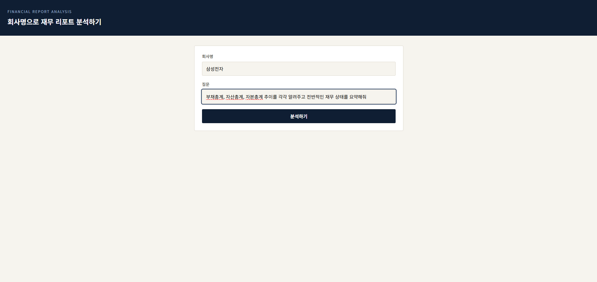

# 재무 리포트 멀티모달 분석 시스템

회사명을 입력하면 DART(전자공시) 데이터를 자동으로 수집해, 재무 상태에 대한 질문에 답하는
시스템입니다. VLM(이미지 이해)과 LLM(텍스트 추론)의 역할을 분리한 멀티모달 파이프라인을
GPU 인스턴스(NVIDIA T4, 16GB) 위에 직접 서빙하는 것을 목표로 합니다.

> ⚠️ 이 프로젝트는 학습/포트폴리오 목적이며, 실제 투자 판단에 사용해서는 안 됩니다.



## 배경 및 설계 의도

- 처음에는 "재무제표(표/텍스트) + 증권사 리포트(차트/이미지)"를 묶어 VLM과 LLM이 함께
  분석하는 구조로 기획했습니다.
- 개발 중 다음을 확인하고 설계를 조정했습니다.
  - DART 사업보고서 원문은 대부분 **PDF가 아니라 HTML/XML**로 제공되며, 통째로 텍스트를
    파싱해 LLM에 넣으면 표 구조가 깨지고 분량이 지나치게 커서(수십만 토큰) 오히려
    답변 품질이 나빠졌습니다.
  - DART는 **재무제표 수치만 정형 데이터로 반환하는 전용 API**
    (`fnlttSinglAcnt.json`)를 제공합니다. 이 API를 우선 사용하는 것으로 전략을
    바꿔, 파싱 오류 없이 정확한 숫자(부채총계/자산총계/자본총계/매출액/영업이익/
    당기순이익, 최근 3개년)를 바로 확보하도록 했습니다.
  - 증권사 리포트(PDF, 차트 포함)는 VLM이 필요한 시나리오를 위해 자동 수집을
    시도하도록 설계했으나(네이버 금융 리서치 크롤링), **실제 페이지 구조 검증까지는
    진행하지 못했고 현재는 항상 실패**합니다 (아래 "알려진 한계" 참고).

## 아키텍처

```
회사명 입력
  ├─ DART 재무제표 API (fnlttSinglAcnt.json)
  │     └─ 부채총계/자산총계/자본총계/매출액/영업이익/당기순이익
  │        (연결재무제표만 필터링, 실제 연도 라벨, "OO조 OO억원" 형식으로 정리)
  ├─ DART 사업보고서 원문 (HTML/XML → 텍스트, 최대 1500자로 제한)
  │     └─ 회사 개요 등 최소한의 맥락용
  └─ 증권사 리포트 PDF (네이버 금융 리서치 크롤링) — 현재 미완성, 항상 실패
        └─ (성공 시) 페이지 이미지 렌더링 → VLM 분석 → 차트/표 요약

  → 위 텍스트를 종합해 LLM(Qwen2.5-7B-Instruct)이 최종 답변 생성
```

- **VLM 역할**: PDF 페이지 이미지에서 차트/표를 읽어 수치와 추세를 자연어로 요약
  (Qwen2-VL-2B-Instruct). 현재는 PDF 소스(증권사 리포트) 수집이 실패하고 있어
  실제로 호출되지 않지만, 파이프라인 코드는 구현되어 있습니다.
- **LLM 역할**: DART 재무 수치 + (짧게 제한된) 사업보고서 개요 + VLM 요약을 받아
  질문에 답변 (Qwen2.5-7B-Instruct).
- **역할을 분리한 이유**: 한 모델이 "숫자 추출"과 "해석"을 동시에 하면 어디서
  틀렸는지 디버깅이 어렵고, 환각(없는 숫자를 지어내는 현상) 위험도 커집니다.

## GPU 메모리 관리 (T4 16GB 대응)

T4에서 VLM(2~7B)과 LLM(7B)을 4bit 양자화해도 **동시에 GPU에 올려두면 메모리가
부족**합니다. 이를 해결하기 위해 각 모델 클래스(`VLMChartAnalyzer`,
`LLMSynthesizer`)는 다음 방식을 사용합니다.

- 생성자에서는 가벼운 processor/tokenizer만 로드하고, 실제 모델 가중치는
  필요한 시점에 로드(`_ensure_loaded`)합니다.
- 사용이 끝나면 `unload()`로 모델을 메모리에서 완전히 삭제하고
  `torch.cuda.empty_cache()`로 GPU를 비웁니다.
- bitsandbytes 4bit 모델은 `.to("cpu")`로 device를 옮길 수 없어서(에러 발생),
  "이동"이 아니라 "삭제 후 재로드" 방식을 사용합니다. 디스크 캐시에서
  다시 불러오는 것이라 재다운로드는 없지만, 매 요청마다 로딩 시간이
  추가되는 트레이드오프가 있습니다.

## 겪었던 주요 문제와 해결

- **OOM (CUDA out of memory)**: 본문 텍스트 길이가 길수록(특히 DART 원문 전체를
  넣었을 때) attention 연산 메모리가 급격히 커져 OOM이 발생했습니다.
  → 본문 텍스트 길이 제한, DART 재무 수치 API로 전환, 모델 로드/언로드 방식으로
  해결했습니다.
- **언어 누출 (한자/영어/일본어가 섞여 나옴)**: 작은 양자화 모델이 프롬프트
  지시("한국어로만 답하세요")를 안정적으로 따르지 못하고, 특정 언어를 막으면
  다른 언어로 새는 현상이 반복됐습니다.
  → 생성 단계에서 한자(유니코드 U+4E00~U+9FFF) 토큰의 확률을 직접
  `-inf`로 만드는 커스텀 `LogitsProcessor`를 적용해 원천 차단했습니다.
- **반복 억제 파라미터의 부작용**: `repetition_penalty`/`no_repeat_ngram_size`를
  넣어 무한 반복은 막았지만, 한국어처럼 음절 단위 토큰화가 촘촘한 언어에서는
  이미 나온 토큰을 억지로 피하다가 존재하지 않는 글자("즧가", "언원" 등)로
  튀는 부작용이 있었습니다.
  → `repetition_penalty=1.0`(비활성화), `no_repeat_ngram_size` 제거로
  해결했습니다. (반복 루프가 재발하면 1.05~1.1 정도로 완화하는 것을 권장합니다.)
- **재무 수치 혼동**: DART는 연결재무제표(CFS)와 별도재무제표(OFS)를 같은
  계정명으로 함께 내려주는데, 구분 없이 다 넣으면 같은 계정이 두 번 다른
  숫자로 나와 LLM이 혼란스러워했습니다.
  → CFS(연결)만 필터링하고, 중복 계정을 제거했습니다.
- **회사명 중복 매칭**: DART 회사 목록에는 상호변경 등으로 같은 이름이 여러
  개 등록된 경우가 있어 잘못된 법인의 데이터를 가져올 위험이 있었습니다.
  → 종목코드(`stock_code`)가 있는(실제 상장된) 항목을 우선 선택하도록 했습니다.

## 요구 사양

- GPU: NVIDIA T4 (16GB VRAM) 기준
- Python 3.10+
- DART Open API 키 (https://opendart.fss.or.kr 무료 발급)

## 설치

```bash
pip install -r requirements.txt --break-system-packages
export DART_API_KEY="발급받은_키"
```

## 실행

```bash
uvicorn app.main:app --host 0.0.0.0 --port 8000
```

브라우저에서 `http://<서버 주소>:8000/` 접속 시 웹 UI가 바로 뜹니다
(회사명/질문 입력 → 분석 결과 확인).

## API 사용

**회사명 기반 자동 분석**
```bash
curl -X POST http://localhost:8000/analyze_by_company \
  -H "Content-Type: application/json" \
  -d '{"company_name": "삼성전자", "question": "부채 추이가 어떻게 돼?"}'
```

응답 예시:
```json
{
  "answer": "부채총계는 2023년 92조 2281억원에서 2024년 112조 3398억원으로 증가하였고, 2025년에는 130조 6217억원으로 다시 증가하였습니다.",
  "sources": ["dart_financials", "dart"],
  "analyzed_pages": {"dart_financials": [], "dart": []}
}
```

**PDF 직접 업로드 분석**
```bash
curl -X POST http://localhost:8000/analyze \
  -F "file=@report.pdf" \
  -F "question=부채 추이가 어떻게 돼?"
```

## 폴더 구조

```
financial-qa-multimodal/
├── app/
│   ├── main.py                  # FastAPI 엔트리포인트 + 웹 UI 서빙
│   ├── pdf_processor.py         # PDF → 텍스트/이미지 분해
│   ├── document_collector.py    # 회사명 → DART 재무API/원문/증권사 리포트 수집
│   └── models/
│       ├── vlm_analyzer.py      # 차트/표 이미지 분석 (VLM, 로드/언로드 관리)
│       └── llm_synthesizer.py   # 종합 판단 (LLM, CJK 차단 로직 포함)
├── static/
│   └── index.html               # 웹 UI (회사명/질문 입력 → 결과 표시)
├── requirements.txt
└── README.md
```

## 알려진 한계

- **증권사 리포트 자동 수집(네이버 금융 리서치 크롤링) 미완성**: 실제 페이지
  HTML 구조를 검증하지 못해 항상 실패합니다. 그 결과 VLM(차트 이미지 분석)이
  실제로 호출되는 경로가 아직 검증되지 않았습니다. `/analyze` 엔드포인트로
  PDF를 직접 업로드하면 VLM 경로를 테스트할 수 있습니다.
- **LLM의 서술형 해석은 완벽하지 않을 수 있음**: 정형 재무 수치(DART API)를
  그대로 인용하는 답변은 안정적으로 나오지만, 복잡한 계산(비율, 여러 지표
  비교)을 요구하면 여전히 부정확할 가능성이 있습니다. 실제 서비스라면
  더 큰 모델, 상용 API, 또는 숫자 검증 후처리 단계를 추가하는 것이
  개선 방향입니다.
- **DART 사업보고서 원문 활용은 최소화됨**: 원문 텍스트가 너무 길고
  구조가 깨지는 문제로 인해 현재는 1500자로 강하게 제한해 최소한의
  회사 개요 정도만 사용합니다.

## 다음 단계 (TODO)

- [ ] 네이버 금융 리서치 페이지 구조 확인 후 크롤링 완성 → VLM 경로 실사용 검증
- [ ] Docker / docker-compose 구성
- [ ] Ansible 배포 자동화
- [ ] 응답 캐싱 (동일 회사 재질문 시)
- [ ] 모니터링 (요청 수, 응답 시간, GPU 사용률)
